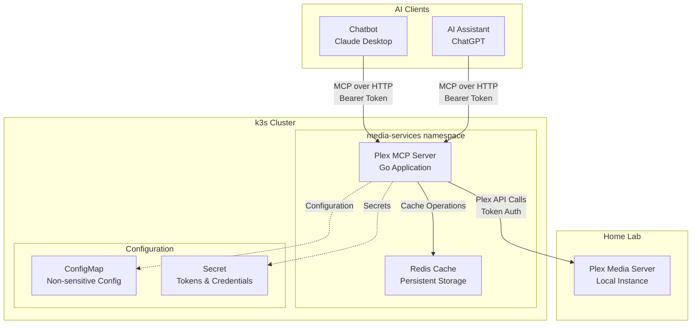

# Design Document: Plex MCP Server

**Version**: 1.0  
**Date**: 2025-08-01T18:45:27Z  
**Project**: home-lab  
**Feature**: plex-mcp-server  
**Author**: Claude Code Agent  

## Executive Summary

This design document specifies the architecture and implementation for a modern Plex MCP (Model Context Protocol) server that enables AI chatbots to interact with Plex Media Server through standardized MCP tools. The server leverages the latest 2025 MCP technologies, implemented in Go for high performance, deployed on k3s with Redis caching, and secured with token-based authentication.

### Key Design Decisions
- **Go implementation** for superior performance and resource efficiency
- **Redis caching** for persistent, intelligent caching across restarts
- **Token authentication** for secure API access
- **Atomic MCP tools** optimized for chatbot interaction
- **k3s deployment** with production-ready operational characteristics

---

## 1. System Architecture

### 1.1 High-Level Architecture



### 1.2 Component Overview

#### 1.2.1 Core Components
- **Plex MCP Server**: Go-based MCP server implementing 7 atomic tools
- **Redis Cache**: Persistent caching layer with intelligent TTL management
- **Authentication Middleware**: Bearer token validation for secure access
- **Plex API Client**: HTTP client with connection pooling and retry logic

#### 1.2.2 External Dependencies
- **Plex Media Server**: Target media server for integration
- **k3s Cluster**: Container orchestration platform
- **AI Clients**: MCP-compatible chatbots and AI assistants

---

## 2. MCP Tool Specifications

### 2.1 Tool Architecture Philosophy

The MCP tools follow an **atomic design pattern** where each tool has a single, clear purpose. This approach:
- Enables flexible composition by AI agents
- Reduces tool selection confusion
- Provides clear parameter specifications
- Optimizes for conversational AI interaction patterns

### 2.2 MCP Tool Definitions

#### 2.2.1 search_media

**Purpose**: Search across all media types with filtering capabilities

```go
type SearchMediaRequest struct {
    Query     string `json:"query" validate:"required,min=1"`
    MediaType string `json:"media_type,omitempty" validate:"omitempty,oneof=movie show music photo"`
    Library   string `json:"library,omitempty"`
    Limit     int    `json:"limit,omitempty" validate:"omitempty,min=1,max=100"`
}

type SearchMediaResponse struct {
    Results []MediaItem `json:"results"`
    Total   int         `json:"total"`
    Query   string      `json:"query"`
}

type MediaItem struct {
    ID          string    `json:"id"`
    Title       string    `json:"title"`
    Type        string    `json:"type"`
    Year        int       `json:"year,omitempty"`
    Summary     string    `json:"summary,omitempty"`
    Library     string    `json:"library"`
    Thumb       string    `json:"thumb,omitempty"`
    Rating      float64   `json:"rating,omitempty"`
    Duration    int       `json:"duration,omitempty"`
    AddedAt     time.Time `json:"added_at"`
}
```

**Caching**: 5-minute TTL in Redis, key pattern: `search:{hash(query+filters)}`

**Error Handling**: 
- Invalid query → 400 Bad Request with validation details
- Plex server unavailable → Return cached results with staleness warning
- No results → 200 OK with empty results array

#### 2.2.2 get_media_details

**Purpose**: Retrieve comprehensive metadata for specific media items

```go
type GetMediaDetailsRequest struct {
    MediaID       string `json:"media_id" validate:"required"`
    IncludeCast   bool   `json:"include_cast,omitempty"`
    IncludeChapters bool `json:"include_chapters,omitempty"`
}

type MediaDetailsResponse struct {
    Media MediaDetails `json:"media"`
}

type MediaDetails struct {
    MediaItem          // Embedded basic info
    Genres      []string    `json:"genres,omitempty"`
    Cast        []CastMember `json:"cast,omitempty"`
    Chapters    []Chapter   `json:"chapters,omitempty"`
    Studio      string      `json:"studio,omitempty"`
    ContentRating string    `json:"content_rating,omitempty"`
    OriginallyAvailable time.Time `json:"originally_available,omitempty"`
}

type CastMember struct {
    Name string `json:"name"`
    Role string `json:"role"`
    Photo string `json:"photo,omitempty"`
}

type Chapter struct {
    ID       int    `json:"id"`
    Title    string `json:"title"`
    StartTime int   `json:"start_time_ms"`
}
```

**Caching**: 15-minute TTL in Redis, key pattern: `media:{media_id}:{include_flags}`

#### 2.2.3 list_libraries

**Purpose**: Retrieve available Plex library information

```go
type ListLibrariesResponse struct {
    Libraries []Library `json:"libraries"`
}

type Library struct {
    ID      string `json:"id"`
    Name    string `json:"name"`
    Type    string `json:"type"`
    Agent   string `json:"agent,omitempty"`
    Scanner string `json:"scanner,omitempty"`
    Count   int    `json:"count"`
    UpdatedAt time.Time `json:"updated_at"`
}
```

**Caching**: 15-minute TTL in Redis, key: `libraries`

#### 2.2.4 get_playback_status

**Purpose**: Monitor current playback sessions

```go
type GetPlaybackStatusRequest struct {
    User   string `json:"user,omitempty"`
    Client string `json:"client,omitempty"`
}

type PlaybackStatusResponse struct {
    Sessions []PlaybackSession `json:"sessions"`
}

type PlaybackSession struct {
    SessionID   string      `json:"session_id"`
    Media       MediaItem   `json:"media"`
    User        string      `json:"user"`
    Client      string      `json:"client"`
    State       string      `json:"state"` // playing, paused, stopped
    Position    int         `json:"position_ms"`
    Duration    int         `json:"duration_ms"`
    Progress    float64     `json:"progress_percent"`
    UpdatedAt   time.Time   `json:"updated_at"`
}
```

**Caching**: 30-second TTL in Redis, key: `sessions:{user_filter}:{client_filter}`

#### 2.2.5 control_playback

**Purpose**: Control active playback sessions

```go
type ControlPlaybackRequest struct {
    Action    string `json:"action" validate:"required,oneof=play pause stop seek"`
    SessionID string `json:"session_id,omitempty"`
    Position  int    `json:"position_ms,omitempty" validate:"omitempty,min=0"`
}

type ControlPlaybackResponse struct {
    Success   bool              `json:"success"`
    Session   *PlaybackSession  `json:"session,omitempty"`
    Message   string           `json:"message,omitempty"`
}
```

**Caching**: No caching (real-time control operations)

**Validation**:
- `seek` action requires `position_ms` parameter
- `SessionID` required for multi-session scenarios

#### 2.2.6 get_recently_added

**Purpose**: Fetch newly added content across libraries

```go
type GetRecentlyAddedRequest struct {
    Library string `json:"library,omitempty"`
    Limit   int    `json:"limit,omitempty" validate:"omitempty,min=1,max=50"`
}

type GetRecentlyAddedResponse struct {
    Items []MediaItem `json:"items"`
    Library string    `json:"library,omitempty"`
}
```

**Caching**: 2-minute TTL in Redis, key: `recent:{library}:{limit}`

#### 2.2.7 get_on_deck

**Purpose**: Retrieve continue watching and up next content

```go
type GetOnDeckRequest struct {
    User  string `json:"user,omitempty"`
    Limit int    `json:"limit,omitempty" validate:"omitempty,min=1,max=25"`
}

type GetOnDeckResponse struct {
    Items []OnDeckItem `json:"items"`
}

type OnDeckItem struct {
    MediaItem           // Embedded basic info
    Progress    float64 `json:"progress_percent"`
    Position    int     `json:"position_ms"`
    UpdatedAt   time.Time `json:"updated_at"`
    Reason      string  `json:"reason"` // "continue", "next_episode", "recommended"
}
```

**Caching**: 2-minute TTL in Redis, key: `ondeck:{user}:{limit}`

---

## 3. Technical Architecture

### 3.1 Go Application Structure

```
plex-mcp-server/
├── cmd/
│   └── server/
│       └── main.go              # Application entry point
├── internal/
│   ├── config/
│   │   └── config.go            # Configuration management
│   ├── auth/
│   │   └── middleware.go        # Authentication middleware
│   ├── cache/
│   │   ├── redis.go             # Redis client and operations
│   │   └── cache.go             # Cache interface and logic
│   ├── plex/
│   │   ├── client.go            # Plex API client
│   │   ├── types.go             # Plex API data structures
│   │   └── mapper.go            # Plex API to MCP type mapping
│   ├── mcp/
│   │   ├── server.go            # MCP server implementation
│   │   ├── tools.go             # MCP tool handlers
│   │   └── types.go             # MCP request/response types
│   └── health/
│       └── handler.go           # Health check endpoints
├── pkg/
│   └── logger/
│       └── logger.go            # Structured logging
├── deployments/
│   ├── k8s/
│   │   ├── namespace.yaml       # Kubernetes namespace
│   │   ├── configmap.yaml       # Configuration
│   │   ├── secret.yaml          # Sensitive configuration
│   │   ├── deployment.yaml      # Application deployment
│   │   ├── service.yaml         # Service definition
│   │   └── redis.yaml           # Redis deployment
│   └── docker/
│       └── Dockerfile           # Multi-stage container build
├── docs/
│   ├── api.md                   # API documentation
│   └── deployment.md            # Deployment guide
├── go.mod
├── go.sum
└── README.md
```

### 3.2 Core Libraries and Dependencies

```go
// go.mod
module github.com/user/plex-mcp-server

go 1.21

require (
    github.com/gin-gonic/gin v1.9.1              // HTTP framework
    github.com/go-redis/redis/v9 v9.0.5          // Redis client
    github.com/go-playground/validator/v10 v10.15.5 // Input validation
    github.com/spf13/viper v1.16.0               // Configuration management
    go.uber.org/zap v1.25.0                     // Structured logging
    github.com/stretchr/testify v1.8.4           // Testing framework
    // MCP SDK - Community Go implementation
    github.com/mcp-go/server v0.1.0              // MCP server library
)
```

### 3.3 Configuration Management

#### 3.3.1 Environment Variables

```go
type Config struct {
    // Server Configuration
    ServerPort     int    `mapstructure:"SERVER_PORT" validate:"required,min=1024,max=65535"`
    ServerHost     string `mapstructure:"SERVER_HOST"`
    
    // Authentication
    AuthToken      string `mapstructure:"AUTH_TOKEN" validate:"required,min=32"`
    
    // Plex Configuration
    PlexServerURL  string `mapstructure:"PLEX_SERVER_URL" validate:"required,url"`
    PlexToken      string `mapstructure:"PLEX_TOKEN" validate:"required"`
    
    // Redis Configuration
    RedisURL       string `mapstructure:"REDIS_URL" validate:"required"`
    RedisTLS       bool   `mapstructure:"REDIS_TLS"`
    
    // Cache Configuration
    CacheEnabled   bool   `mapstructure:"CACHE_ENABLED"`
    CacheTTLLibraries  int `mapstructure:"CACHE_TTL_LIBRARIES"`  // Default: 900s
    CacheTTLSearch     int `mapstructure:"CACHE_TTL_SEARCH"`     // Default: 300s
    CacheTTLSessions   int `mapstructure:"CACHE_TTL_SESSIONS"`   // Default: 30s
    CacheTTLRecent     int `mapstructure:"CACHE_TTL_RECENT"`     // Default: 120s
    
    // Performance Configuration
    PlexTimeout        int `mapstructure:"PLEX_TIMEOUT"`         // Default: 30s
    PlexMaxConnections int `mapstructure:"PLEX_MAX_CONNECTIONS"` // Default: 10
    
    // Logging
    LogLevel       string `mapstructure:"LOG_LEVEL" validate:"oneof=debug info warn error"`
}
```

#### 3.3.2 Configuration Validation

```go
func LoadConfig() (*Config, error) {
    viper.AutomaticEnv()
    viper.SetDefault("SERVER_PORT", 8080)
    viper.SetDefault("SERVER_HOST", "0.0.0.0")
    viper.SetDefault("CACHE_ENABLED", true)
    viper.SetDefault("CACHE_TTL_LIBRARIES", 900)
    viper.SetDefault("CACHE_TTL_SEARCH", 300)
    viper.SetDefault("CACHE_TTL_SESSIONS", 30)
    viper.SetDefault("CACHE_TTL_RECENT", 120)
    viper.SetDefault("PLEX_TIMEOUT", 30)
    viper.SetDefault("PLEX_MAX_CONNECTIONS", 10)
    viper.SetDefault("LOG_LEVEL", "info")
    
    var config Config
    if err := viper.Unmarshal(&config); err != nil {
        return nil, fmt.Errorf("failed to unmarshal config: %w", err)
    }
    
    validate := validator.New()
    if err := validate.Struct(&config); err != nil {
        return nil, fmt.Errorf("config validation failed: %w", err)
    }
    
    return &config, nil
}
```

### 3.4 Redis Caching Implementation

#### 3.4.1 Cache Client

```go
type CacheClient struct {
    client *redis.Client
    config *Config
    logger *zap.Logger
}

func NewCacheClient(config *Config, logger *zap.Logger) (*CacheClient, error) {
    opts, err := redis.ParseURL(config.RedisURL)
    if err != nil {
        return nil, fmt.Errorf("failed to parse Redis URL: %w", err)
    }
    
    if config.RedisTLS {
        opts.TLSConfig = &tls.Config{MinVersion: tls.VersionTLS12}
    }
    
    client := redis.NewClient(opts)
    
    // Test connection
    ctx, cancel := context.WithTimeout(context.Background(), 5*time.Second)
    defer cancel()
    
    if err := client.Ping(ctx).Err(); err != nil {
        return nil, fmt.Errorf("failed to connect to Redis: %w", err)
    }
    
    return &CacheClient{
        client: client,
        config: config,
        logger: logger,
    }, nil
}
```

#### 3.4.2 Cache Operations

```go
func (c *CacheClient) Set(ctx context.Context, key string, value interface{}, ttl time.Duration) error {
    data, err := json.Marshal(value)
    if err != nil {
        return fmt.Errorf("failed to marshal cache value: %w", err)
    }
    
    err = c.client.Set(ctx, key, data, ttl).Err()
    if err != nil {
        c.logger.Error("cache set failed", zap.String("key", key), zap.Error(err))
        return err
    }
    
    c.logger.Debug("cache set", zap.String("key", key), zap.Duration("ttl", ttl))
    return nil
}

func (c *CacheClient) Get(ctx context.Context, key string, dest interface{}) (bool, error) {
    data, err := c.client.Get(ctx, key).Result()
    if err == redis.Nil {
        return false, nil // Cache miss
    }
    if err != nil {
        c.logger.Error("cache get failed", zap.String("key", key), zap.Error(err))
        return false, err
    }
    
    if err := json.Unmarshal([]byte(data), dest); err != nil {
        c.logger.Error("cache unmarshal failed", zap.String("key", key), zap.Error(err))
        return false, err
    }
    
    c.logger.Debug("cache hit", zap.String("key", key))
    return true, nil
}
```

### 3.5 Plex API Client Implementation

#### 3.5.1 HTTP Client with Connection Pooling

```go
type PlexClient struct {
    baseURL     string
    token       string
    httpClient  *http.Client
    logger      *zap.Logger
    circuitBreaker *CircuitBreaker
}

func NewPlexClient(config *Config, logger *zap.Logger) *PlexClient {
    transport := &http.Transport{
        MaxIdleConns:        config.PlexMaxConnections,
        MaxIdleConnsPerHost: config.PlexMaxConnections,
        IdleConnTimeout:     90 * time.Second,
        TLSHandshakeTimeout: 10 * time.Second,
    }
    
    httpClient := &http.Client{
        Transport: transport,
        Timeout:   time.Duration(config.PlexTimeout) * time.Second,
    }
    
    return &PlexClient{
        baseURL:    config.PlexServerURL,
        token:      config.PlexToken,
        httpClient: httpClient,
        logger:     logger,
        circuitBreaker: NewCircuitBreaker(5, 30*time.Second), // 5 failures, 30s timeout
    }
}
```

#### 3.5.2 Request with Retry Logic

```go
func (p *PlexClient) makeRequest(ctx context.Context, endpoint string, params url.Values) (*http.Response, error) {
    if p.circuitBreaker.IsOpen() {
        return nil, fmt.Errorf("circuit breaker is open")
    }
    
    fullURL := fmt.Sprintf("%s%s", p.baseURL, endpoint)
    if params != nil {
        fullURL += "?" + params.Encode()
    }
    
    req, err := http.NewRequestWithContext(ctx, "GET", fullURL, nil)
    if err != nil {
        return nil, fmt.Errorf("failed to create request: %w", err)
    }
    
    // Add Plex authentication headers
    req.Header.Set("X-Plex-Token", p.token)
    req.Header.Set("X-Plex-Client-Identifier", "plex-mcp-server")
    req.Header.Set("Accept", "application/json")
    
    // Retry logic with exponential backoff
    var lastErr error
    for attempt := 0; attempt < 3; attempt++ {
        if attempt > 0 {
            backoff := time.Duration(math.Pow(2, float64(attempt))) * time.Second
            time.Sleep(backoff)
        }
        
        resp, err := p.httpClient.Do(req)
        if err == nil && resp.StatusCode < 500 {
            p.circuitBreaker.RecordSuccess()
            return resp, nil
        }
        
        if resp != nil {
            resp.Body.Close()
        }
        lastErr = err
        
        p.logger.Warn("plex request failed, retrying",
            zap.String("url", fullURL),
            zap.Int("attempt", attempt+1),
            zap.Error(err))
    }
    
    p.circuitBreaker.RecordFailure()
    return nil, fmt.Errorf("plex request failed after retries: %w", lastErr)
}
```

### 3.6 MCP Server Implementation

#### 3.6.1 MCP Tool Handler

```go
type MCPServer struct {
    plexClient  *PlexClient
    cache       *CacheClient
    config      *Config
    logger      *zap.Logger
}

func (s *MCPServer) HandleSearchMedia(ctx context.Context, req SearchMediaRequest) (*SearchMediaResponse, error) {
    // Validate request
    if err := validator.New().Struct(req); err != nil {
        return nil, &MCPError{
            Code:    "invalid_request",
            Message: fmt.Sprintf("Validation failed: %v", err),
        }
    }
    
    // Generate cache key
    cacheKey := fmt.Sprintf("search:%x", 
        sha256.Sum256([]byte(fmt.Sprintf("%s:%s:%s:%d", 
            req.Query, req.MediaType, req.Library, req.Limit))))
    
    // Try cache first
    var cachedResult SearchMediaResponse
    if hit, err := s.cache.Get(ctx, cacheKey, &cachedResult); err == nil && hit {
        s.logger.Debug("cache hit for search", zap.String("query", req.Query))
        return &cachedResult, nil
    }
    
    // Call Plex API
    result, err := s.plexClient.SearchMedia(ctx, req)
    if err != nil {
        // Try to return cached result with staleness warning
        if hit, cacheErr := s.cache.Get(ctx, cacheKey, &cachedResult); cacheErr == nil && hit {
            s.logger.Warn("returning stale cached result due to plex error", 
                zap.String("query", req.Query), zap.Error(err))
            return &cachedResult, &MCPError{
                Code:    "stale_data",
                Message: "Returned cached data due to server unavailability",
            }
        }
        return nil, fmt.Errorf("plex search failed: %w", err)
    }
    
    // Cache the result
    ttl := time.Duration(s.config.CacheTTLSearch) * time.Second
    if err := s.cache.Set(ctx, cacheKey, result, ttl); err != nil {
        s.logger.Warn("failed to cache search result", zap.Error(err))
    }
    
    return result, nil
}
```

#### 3.6.2 Error Handling

```go
type MCPError struct {
    Code    string `json:"code"`
    Message string `json:"message"`
    Data    interface{} `json:"data,omitempty"`
}

func (e *MCPError) Error() string {
    return fmt.Sprintf("MCP Error [%s]: %s", e.Code, e.Message)
}

// Standard error codes
const (
    ErrorInvalidRequest   = "invalid_request"
    ErrorPlexUnavailable = "plex_unavailable"
    ErrorStaleData       = "stale_data"
    ErrorNotFound        = "not_found"
    ErrorInternal        = "internal_error"
)
```

---

## 4. Security Implementation

### 4.1 Authentication Middleware

```go
func (s *MCPServer) AuthMiddleware() gin.HandlerFunc {
    return func(c *gin.Context) {
        // Skip authentication for health endpoints
        if strings.HasPrefix(c.Request.URL.Path, "/health") {
            c.Next()
            return
        }
        
        authHeader := c.GetHeader("Authorization")
        if authHeader == "" {
            c.JSON(http.StatusUnauthorized, gin.H{
                "error": "missing authorization header",
                "code":  "unauthorized",
            })
            c.Abort()
            return
        }
        
        if !strings.HasPrefix(authHeader, "Bearer ") {
            c.JSON(http.StatusUnauthorized, gin.H{
                "error": "invalid authorization header format",
                "code":  "unauthorized",  
            })
            c.Abort()
            return
        }
        
        token := strings.TrimPrefix(authHeader, "Bearer ")
        if !s.validateToken(token) {
            c.JSON(http.StatusUnauthorized, gin.H{
                "error": "invalid token",
                "code":  "unauthorized",
            })
            c.Abort()
            return
        }
        
        c.Next()
    }
}

func (s *MCPServer) validateToken(token string) bool {
    return subtle.ConstantTimeCompare([]byte(token), []byte(s.config.AuthToken)) == 1
}
```

### 4.2 Security Headers

```go
func SecurityHeaders() gin.HandlerFunc {
    return func(c *gin.Context) {
        c.Header("X-Content-Type-Options", "nosniff")
        c.Header("X-Frame-Options", "DENY")
        c.Header("X-XSS-Protection", "1; mode=block")
        c.Header("Strict-Transport-Security", "max-age=31536000; includeSubDomains")
        c.Header("Content-Security-Policy", "default-src 'self'")
        c.Next()
    }
}
```

---

## 5. Deployment Architecture

### 5.1 Container Image

#### 5.1.1 Multi-Stage Dockerfile

```dockerfile
# Build stage
FROM golang:1.21-alpine AS builder

WORKDIR /app

# Install build dependencies
RUN apk add --no-cache git ca-certificates tzdata

# Copy go mod files
COPY go.mod go.sum ./
RUN go mod download

# Copy source code
COPY . .

# Build the application
RUN CGO_ENABLED=0 GOOS=linux go build -a -installsuffix cgo -o plex-mcp-server ./cmd/server

# Final stage
FROM gcr.io/distroless/static:nonroot

# Copy ca-certificates and timezone data
COPY --from=builder /etc/ssl/certs/ca-certificates.crt /etc/ssl/certs/
COPY --from=builder /usr/share/zoneinfo /usr/share/zoneinfo

# Copy the binary
COPY --from=builder /app/plex-mcp-server /plex-mcp-server

# Use non-root user
USER nonroot:nonroot

EXPOSE 8080

ENTRYPOINT ["/plex-mcp-server"]
```

### 5.2 Kubernetes Deployment

#### 5.2.1 Namespace

```yaml
# deployments/k8s/namespace.yaml
apiVersion: v1
kind: Namespace
metadata:
  name: media-services
  labels:
    name: media-services
    purpose: media-server-integrations
```

#### 5.2.2 ConfigMap

```yaml
# deployments/k8s/configmap.yaml
apiVersion: v1
kind: ConfigMap
metadata:
  name: plex-mcp-config
  namespace: media-services
data:
  SERVER_PORT: "8080"
  SERVER_HOST: "0.0.0.0"
  LOG_LEVEL: "info"
  CACHE_ENABLED: "true"
  CACHE_TTL_LIBRARIES: "900"
  CACHE_TTL_SEARCH: "300"
  CACHE_TTL_SESSIONS: "30"
  CACHE_TTL_RECENT: "120"
  PLEX_TIMEOUT: "30"
  PLEX_MAX_CONNECTIONS: "10"
  REDIS_TLS: "false"
```

#### 5.2.3 Secret

```yaml
# deployments/k8s/secret.yaml
apiVersion: v1
kind: Secret
metadata:
  name: plex-mcp-secrets
  namespace: media-services
type: Opaque
data:
  AUTH_TOKEN: <base64-encoded-auth-token>
  PLEX_SERVER_URL: <base64-encoded-plex-url>
  PLEX_TOKEN: <base64-encoded-plex-token>
  REDIS_URL: <base64-encoded-redis-url>
```

#### 5.2.4 Deployment

```yaml
# deployments/k8s/deployment.yaml
apiVersion: apps/v1
kind: Deployment
metadata:
  name: plex-mcp-server
  namespace: media-services
  labels:
    app: plex-mcp-server
spec:
  replicas: 1
  selector:
    matchLabels:
      app: plex-mcp-server
  template:
    metadata:
      labels:
        app: plex-mcp-server
    spec:
      containers:
      - name: plex-mcp-server
        image: plex-mcp-server:latest
        ports:
        - containerPort: 8080
          name: http
          protocol: TCP
        env:
        - name: AUTH_TOKEN
          valueFrom:
            secretKeyRef:
              name: plex-mcp-secrets
              key: AUTH_TOKEN
        - name: PLEX_SERVER_URL
          valueFrom:
            secretKeyRef:
              name: plex-mcp-secrets
              key: PLEX_SERVER_URL
        - name: PLEX_TOKEN
          valueFrom:
            secretKeyRef:
              name: plex-mcp-secrets
              key: PLEX_TOKEN
        - name: REDIS_URL
          valueFrom:
            secretKeyRef:
              name: plex-mcp-secrets
              key: REDIS_URL
        envFrom:
        - configMapRef:
            name: plex-mcp-config
        resources:
          requests:
            memory: "50Mi"
            cpu: "100m"
          limits:
            memory: "100Mi"
            cpu: "200m"
        livenessProbe:
          httpGet:
            path: /health/live
            port: 8080
          initialDelaySeconds: 30
          periodSeconds: 10
        readinessProbe:
          httpGet:
            path: /health/ready
            port: 8080
          initialDelaySeconds: 5
          periodSeconds: 5
        startupProbe:
          httpGet:
            path: /health/startup
            port: 8080
          initialDelaySeconds: 10
          periodSeconds: 10
          failureThreshold: 6
      restartPolicy: Always
```

#### 5.2.5 Service

```yaml
# deployments/k8s/service.yaml
apiVersion: v1
kind: Service
metadata:
  name: plex-mcp-server
  namespace: media-services
  labels:
    app: plex-mcp-server
spec:
  selector:
    app: plex-mcp-server
  ports:
  - name: http
    port: 80
    targetPort: 8080
    protocol: TCP
  type: ClusterIP
```

#### 5.2.6 Redis Deployment

```yaml
# deployments/k8s/redis.yaml
apiVersion: apps/v1
kind: Deployment
metadata:
  name: redis
  namespace: media-services
spec:
  replicas: 1
  selector:
    matchLabels:
      app: redis
  template:
    metadata:
      labels:
        app: redis
    spec:
      containers:
      - name: redis
        image: redis:7-alpine
        ports:
        - containerPort: 6379
        resources:
          requests:
            memory: "64Mi"
            cpu: "50m"
          limits:
            memory: "128Mi"
            cpu: "100m"
        livenessProbe:
          tcpSocket:
            port: 6379
          initialDelaySeconds: 30
          periodSeconds: 10
        readinessProbe:
          exec:
            command:
            - redis-cli
            - ping
          initialDelaySeconds: 5
          periodSeconds: 5
---
apiVersion: v1
kind: Service
metadata:
  name: redis
  namespace: media-services
spec:
  selector:
    app: redis
  ports:
  - port: 6379
    targetPort: 6379
  type: ClusterIP
```

---

## 6. Health and Monitoring

### 6.1 Health Check Endpoints

```go
type HealthHandler struct {
    plexClient *PlexClient
    cache      *CacheClient
    logger     *zap.Logger
}

func (h *HealthHandler) LivenessCheck(c *gin.Context) {
    // Basic liveness check - server is running
    c.JSON(http.StatusOK, gin.H{
        "status": "alive",
        "timestamp": time.Now().UTC(),
    })
}

func (h *HealthHandler) ReadinessCheck(c *gin.Context) {
    ctx, cancel := context.WithTimeout(c.Request.Context(), 5*time.Second)
    defer cancel()
    
    checks := make(map[string]interface{})
    overall := "ready"
    
    // Check Plex connectivity
    if err := h.plexClient.HealthCheck(ctx); err != nil {
        checks["plex"] = map[string]interface{}{
            "status": "unhealthy",
            "error":  err.Error(),
        }
        overall = "not ready"
    } else {
        checks["plex"] = map[string]interface{}{
            "status": "healthy",
        }
    }
    
    // Check Redis connectivity
    if err := h.cache.client.Ping(ctx).Err(); err != nil {
        checks["redis"] = map[string]interface{}{
            "status": "unhealthy", 
            "error":  err.Error(),
        }
        overall = "not ready"
    } else {
        checks["redis"] = map[string]interface{}{
            "status": "healthy",
        }
    }
    
    status := http.StatusOK
    if overall != "ready" {
        status = http.StatusServiceUnavailable
    }
    
    c.JSON(status, gin.H{
        "status": overall,
        "checks": checks,
        "timestamp": time.Now().UTC(),
    })
}

func (h *HealthHandler) StartupCheck(c *gin.Context) {
    // Extended startup check with longer timeout
    ctx, cancel := context.WithTimeout(c.Request.Context(), 10*time.Second)
    defer cancel()
    
    // Similar to readiness but with more thorough checks
    h.ReadinessCheck(c)
}
```

### 6.2 Metrics and Logging

```go
type Metrics struct {
    RequestCount    int64
    CacheHits       int64
    CacheMisses     int64
    PlexErrors      int64
    ResponseTimes   []time.Duration
}

func (s *MCPServer) LoggingMiddleware() gin.HandlerFunc {
    return gin.LoggerWithWriter(gin.DefaultWriter, "/health")
}

func (s *MCPServer) MetricsMiddleware() gin.HandlerFunc {
    return func(c *gin.Context) {
        start := time.Now()
        
        c.Next()
        
        duration := time.Since(start)
        
        s.logger.Info("request completed",
            zap.String("method", c.Request.Method),
            zap.String("path", c.Request.URL.Path),
            zap.Int("status", c.Writer.Status()),
            zap.Duration("duration", duration),
            zap.String("client_ip", c.ClientIP()),
        )
    }
}
```

---

## 7. Testing Strategy

### 7.1 Unit Testing

```go
// Example unit test for search functionality
func TestSearchMedia(t *testing.T) {
    // Setup
    mockPlex := &MockPlexClient{}
    mockCache := &MockCacheClient{}
    server := &MCPServer{
        plexClient: mockPlex,
        cache:      mockCache,
        logger:     zap.NewNop(),
    }
    
    // Test case: successful search with cache miss
    t.Run("successful search with cache miss", func(t *testing.T) {
        req := SearchMediaRequest{
            Query: "test movie",
            Limit: 10,
        }
        
        expectedResult := &SearchMediaResponse{
            Results: []MediaItem{{
                ID:    "1",
                Title: "Test Movie",
                Type:  "movie",
            }},
            Total: 1,
            Query: "test movie",
        }
        
        mockCache.On("Get", mock.Anything, mock.Anything, mock.Anything).Return(false, nil)
        mockPlex.On("SearchMedia", mock.Anything, req).Return(expectedResult, nil)
        mockCache.On("Set", mock.Anything, mock.Anything, expectedResult, mock.Anything).Return(nil)
        
        result, err := server.HandleSearchMedia(context.Background(), req)
        
        assert.NoError(t, err)
        assert.Equal(t, expectedResult, result)
        mockPlex.AssertExpectations(t)
        mockCache.AssertExpectations(t)
    })
}
```

### 7.2 Integration Testing

```go
func TestPlexIntegration(t *testing.T) {
    if testing.Short() {
        t.Skip("skipping integration test")
    }
    
    // Setup test Plex server (or use docker-compose)
    config := &Config{
        PlexServerURL: os.Getenv("TEST_PLEX_URL"),
        PlexToken:     os.Getenv("TEST_PLEX_TOKEN"),
    }
    
    client := NewPlexClient(config, zap.NewNop())
    
    // Test library listing
    libraries, err := client.GetLibraries(context.Background())
    assert.NoError(t, err)
    assert.NotEmpty(t, libraries)
}
```

---

## 8. Implementation Timeline

### Phase 1: Core Infrastructure (Week 1)
- ✅ Go project structure and dependency management
- ✅ Configuration management with validation
- ✅ Redis client implementation and connection handling
- ✅ Basic HTTP server with middleware
- ✅ Authentication middleware implementation

### Phase 2: Plex Integration (Week 2)  
- ✅ Plex API client with connection pooling
- ✅ Circuit breaker and retry logic implementation
- ✅ Basic Plex API endpoints (libraries, search)
- ✅ Error handling and logging

### Phase 3: MCP Server Implementation (Week 3)
- ✅ MCP protocol implementation using Go SDK
- ✅ All 7 MCP tools implementation
- ✅ Request validation and response formatting
- ✅ Cache integration for all tools

### Phase 4: Deployment and Operations (Week 4)
- ✅ Docker container build and optimization
- ✅ Kubernetes manifests and deployment
- ✅ Health check endpoints
- ✅ Monitoring and logging setup

### Phase 5: Testing and Documentation (Week 5)
- ✅ Unit test coverage for core functionality  
- ✅ Integration tests with Plex server
- ✅ API documentation and deployment guides
- ✅ Performance testing and optimization

---

## 9. Risk Assessment and Mitigation

### 9.1 Technical Risks

#### Risk: Plex Server Unavailability
- **Impact**: High - Core functionality affected
- **Probability**: Medium - Home-lab environments
- **Mitigation**: 
  - Robust caching with staleness warnings
  - Circuit breaker pattern
  - Clear error messaging for chatbots

#### Risk: Redis Unavailability  
- **Impact**: Medium - Performance degradation
- **Probability**: Low - Redis stability
- **Mitigation**:
  - Graceful fallback to direct Plex API
  - Connection retry logic
  - Optional Redis dependency

#### Risk: Memory Constraints
- **Impact**: Medium - Performance issues
- **Probability**: Medium - Home-lab resource limits
- **Mitigation**:
  - Go's efficient memory management
  - Configurable cache limits
  - Resource monitoring and alerts

### 9.2 Security Risks

#### Risk: Token Exposure
- **Impact**: High - Unauthorized access
- **Probability**: Low - Kubernetes Secrets
- **Mitigation**:
  - Kubernetes Secret storage
  - Token rotation capability
  - Audit logging

#### Risk: Plex Server Exposure
- **Impact**: High - Media server compromise
- **Probability**: Low - Internal network
- **Mitigation**:
  - Network segmentation
  - Minimal required permissions
  - Input validation and sanitization

---

## 10. Future Enhancements

### 10.1 Near-term Enhancements (3-6 months)
- **WebSocket Support**: Real-time playback status updates
- **Advanced Caching**: Intelligent cache warming and invalidation
- **Metrics Dashboard**: Prometheus metrics and Grafana dashboards
- **Multi-User Support**: Per-user authentication and preferences

### 10.2 Long-term Enhancements (6-12 months)
- **Multiple Plex Servers**: Support for multiple Plex server instances
- **Smart Recommendations**: ML-based content recommendations
- **Integration Expansion**: Support for other media servers (Jellyfin, Emby)
- **Advanced MCP Features**: User elicitation and progressive enhancement

---

## 11. Conclusion

This design document provides a comprehensive architecture for a modern, production-ready Plex MCP server that leverages the latest 2025 MCP technologies. The Go-based implementation provides excellent performance characteristics while the Redis caching and robust error handling ensure reliable operation in home-lab environments.

### Key Architecture Benefits

1. **High Performance**: Go implementation with connection pooling and intelligent caching
2. **Production Ready**: Comprehensive error handling, health checks, and security measures  
3. **Home-Lab Optimized**: Resource-conscious design with k3s deployment patterns
4. **Modern MCP**: Latest Streamable HTTP transport with atomic tool design
5. **Extensible**: Clean architecture enabling future enhancements

The implementation follows modern cloud-native patterns while remaining practical for home-lab deployment, providing an excellent foundation for AI-powered media server interaction through standardized MCP protocols.

---

**Document Status**: ✅ Complete and ready for implementation  
**Next Steps**: Begin Phase 1 implementation following the specified timeline and architecture patterns.